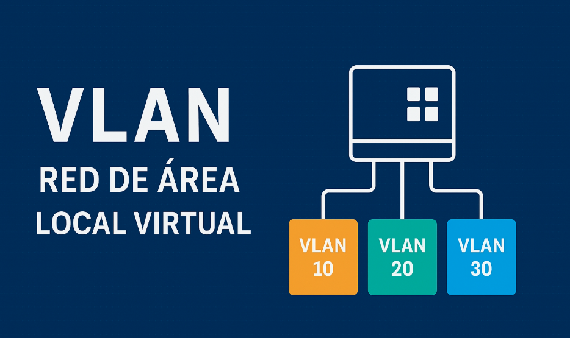

# 🌐 Trabajo Práctico Teórico: Programación sobre Redes

**Institución:** IFTS 18  
**Carrera:** Técnico Superior en Desarrollo de Software  
**Profesor:** Lucas Rusatti  
**Grupo:** D  

---

## 👥 Integrantes
* **Diego Murgana** - *Administrador del Proyecto*
* **Leandro Sosa**
* **Agustín Senin**
* **Santiago Padilla**

---

## 📍 Índice de Contenidos
| | | |
| :--- | :--- | :--- |
| 1. [VLAN](#1-qué-es-una-vlan) | 12. [Wireless y Estándares](#12-explicar-las-tecnologías-wireless-y-sus-estándares) | 23. [Solución Microsoft Teams](#23-explique-la-solución-de-microsoft-teams) |
| 2. [VPN](#2-qué-es-una-vpn) | 13. [¿Qué es un Proxy?](#13-qué-es-un-proxy) | 24. [Calidad en Enlace MPLS](#24-qué-significa-aplicar-calidad-en-un-enlace-mpls) |
| 3. [SAN](#3-qué-es-una-san) | 14. [Spanning Tree](#14-explicar-el-protocolo-spanning-tree) | 25. [Coaxial, UTP o Fibra](#25-qué-diferencias-puede-encontrar-entre-una-conexión-coaxial-utp-o-fibra) |
| 4. [Dispositivos de Red](#4-diferencias-entre-un-hub-repetidor-router-y-switch) | 15. [Protocolo OSPF](#15-explicar-el-protocolo-de-comunicaciones-ospf) | 26. [Certificaciones Cisco](#26-según-cisco-qué-significa-ccent-ccna-y-ccnp) |
| 5. [Protocolo de Comuna.](#5-qué-es-un-protocolo-de-comunicaciones) | 16. [Protocolo ARP](#16-explicar-el-protocolo-arp) | 27. [Modelo OSI](#27-explique-el-modelo-osi) |
| 6. [TCP/IP y NetBios](#6-explique-tcpip-y-netbios-resuma-sus-diferencias) | 17. [¿Qué es un Firewall?](#17-qué-es-un-firewall) | 28. [Estándar IEEE 802.3](#28-explicar-el-estándar-ieee-8023-regula-la-red) |
| 7. [Paquete TCP/IP y Flags](#7-cómo-está-formado-un-paquete-de-datos-en-tcpip-qué-es-un-flag-en-un-paquete-de-tcpip) | 18. [¿Qué es una DMZ?](#18-qué-es-una-dmz) | 29. [Estándar IEEE 802.4](#29-explicar-el-estándar-ieee-8024-regula-la-red) |
| 8. [Red según Geografía](#8-defina-la-red-según-su-geografía-explicar-distintas-variantes) | 19. [¿Qué es un Gateway?](#19-qué-es-un-gateway) | 30. [Protocolos de envío/recepción de correo](#30-qué-protocolos-se-usan-para-enviar-y-recibir-correo) |
| 9. [Red según Topología](#9-defina-una-red-según-su-topología-explicar-distintas-variantes) | 20. [Significado de NBL](#20-según-microsoft-qué-significa-nbl) | 31. [Protocolo para leer correo](#31-qué-protocolo-puede-usarse-para-leer-correo-recibido) |
| 10. [Servicio DHCP](#10-explicar-el-servicio-de-dhcp) | 21. [Tipos de enlace](#21-tipos-de-enlace-mpls-lan-to-lan-microonda-vsat) | 32. [Diferencias IPv4 e IPv6](#32-diferencias-entre-ipv4-e-ipv6) |
| 11. [Servicio DNS](#11-explicar-el-servicio-de-dns) | 22. [Tecnología LTE](#22-describir-la-tecnología-lte) | 33. [Experiencia Personal](#33-individual-para-cada-integrante-del-grupo-qué-experiencia-tienen-en-redes) |

---

## 📖 Desarrollo del Cuestionario

### 1. ¿Qué es una VLAN?
**Punto clave:** Una **VLAN** (Virtual Local Area Network) es una subdivisión lógica de una red física local que permite agrupar dispositivos como si estuvieran en la misma red.

[⬆ Volver al Índice](#-índice-de-contenidos)

---

### 2. ¿Qué es una VPN?
**Punto clave:** Una **VPN** (Virtual Private Network) es una tecnología que crea un túnel cifrado y seguro sobre una red pública.

[Image of VPN tunnel encrypted connection]

[⬆ Volver al Índice](#-índice-de-contenidos)

---

### 3. ¿Qué es una SAN?
**Punto clave:** Una **SAN** (Storage Area Network) es una red de alta velocidad diseñada para conectar servidores a almacenamiento masivo.

[Image of SAN architecture diagram]

[⬆ Volver al Índice](#-índice-de-contenidos)

---

### 4. Diferencias entre un Hub, Repetidor, Router y SWITCH
**Punto clave:** Estos dispositivos operan en diferentes capas del modelo OSI y tienen distintos niveles de inteligencia.

| Dispositivo | Capa OSI | Inteligencia |
| :--- | :--- | :--- |
| **Repetidor** | 1 | Nula |
| **Hub** | 1 | Baja |
| **Switch** | 2 | Media |
| **Router** | 3 | Alta |

[⬆ Volver al Índice](#-índice-de-contenidos)

---

### 5. ¿Qué es un protocolo de comunicaciones?
**Punto clave:** Conjunto de reglas que permiten que dos o más entidades se comuniquen entre sí compartiendo sintaxis y semántica.

[⬆ Volver al Índice](#-índice-de-contenidos)

---

### 6. Explique TCP/IP y NetBios, resuma sus diferencias.
*Contenido en desarrollo...*

[⬆ Volver al Índice](#-índice-de-contenidos)

---

### 7. ¿Cómo está formado un paquete de datos en TCP/IP? ¿Qué es un “flag” en un paquete de TCP/IP?
*Contenido en desarrollo...*

[⬆ Volver al Índice](#-índice-de-contenidos)

---

### 8. Defina la red según su geografía. Explicar distintas variantes.
*Contenido en desarrollo...*

[⬆ Volver al Índice](#-índice-de-contenidos)

---

### 9. Defina una red según su topología. Explicar distintas variantes.
*Contenido en desarrollo...*

[⬆ Volver al Índice](#-índice-de-contenidos)

---

### 10. Explicar el servicio de DHCP.
*Contenido en desarrollo...*

[⬆ Volver al Índice](#-índice-de-contenidos)

---

### 11. Explicar el servicio de DNS.
*Contenido en desarrollo...*

[⬆ Volver al Índice](#-índice-de-contenidos)

---

### 12. Explicar las tecnologías Wireless, y sus estándares.
*Contenido en desarrollo...*

[⬆ Volver al Índice](#-índice-de-contenidos)

---

### 13. ¿Qué es un Proxy?
*Contenido en desarrollo...*

[⬆ Volver al Índice](#-índice-de-contenidos)

---

### 14. Explicar el protocolo Spanning tree.
*Contenido en desarrollo...*

[⬆ Volver al Índice](#-índice-de-contenidos)

---

### 15. Explicar el protocolo de comunicaciones OSPF.
*Contenido en desarrollo...*

[⬆ Volver al Índice](#-índice-de-contenidos)

---

### 16. Explicar el protocolo ARP.
*Contenido en desarrollo...*

[⬆ Volver al Índice](#-índice-de-contenidos)

---

### 17. ¿Qué es un Firewall?
*Contenido en desarrollo...*

[⬆ Volver al Índice](#-índice-de-contenidos)

---

### 18. ¿Qué es una DMZ?
*Contenido en desarrollo...*

[⬆ Volver al Índice](#-índice-de-contenidos)

---

### 19. ¿Qué es un Gateway?
*Contenido en desarrollo...*

[⬆ Volver al Índice](#-índice-de-contenidos)

---

### 20. Según Microsoft, ¿qué significa NBL?
*Contenido en desarrollo...*

[⬆ Volver al Índice](#-índice-de-contenidos)

---

### 21. Tipos de enlace: MPLS, LAN to LAN, microonda, VSAT.
*Contenido en desarrollo...*

[⬆ Volver al Índice](#-índice-de-contenidos)

---

### 22. Describir la tecnología LTE.
*Contenido en desarrollo...*

[⬆ Volver al Índice](#-índice-de-contenidos)

---

### 23. Explique la solución de Microsoft Teams.
*Contenido en desarrollo...*

[⬆ Volver al Índice](#-índice-de-contenidos)

---

### 24. ¿Qué significa aplicar calidad en un enlace MPLS?
*Contenido en desarrollo...*

[⬆ Volver al Índice](#-índice-de-contenidos)

---

### 25. ¿Qué diferencias puede encontrar entre una conexión Coaxial, UTP o Fibra?
*Contenido en desarrollo...*

[⬆ Volver al Índice](#-índice-de-contenidos)

---

### 26. Según Cisco, ¿qué significa CCENT, CCNA y CCNP?
*Contenido en desarrollo...*

[⬆ Volver al Índice](#-índice-de-contenidos)

---

### 27. Explique el modelo OSI.
*Contenido en desarrollo...*

[⬆ Volver al Índice](#-índice-de-contenidos)

---

### 28. Explicar el estándar IEEE 802.3 regula la red.
*Contenido en desarrollo...*

[⬆ Volver al Índice](#-índice-de-contenidos)

---

### 29. Explicar el estándar IEEE 802.4 regula la red.
*Contenido en desarrollo...*

[⬆ Volver al Índice](#-índice-de-contenidos)

---

### 30. ¿Qué protocolos se usan para enviar y recibir correo?
*Contenido en desarrollo...*

[⬆ Volver al Índice](#-índice-de-contenidos)

---

### 31. ¿Qué protocolo puede usarse para leer correo recibido?
*Contenido en desarrollo...*

[⬆ Volver al Índice](#-índice-de-contenidos)

---

### 32. Diferencias entre IPV4 e IPV6
*Contenido en desarrollo...*

[⬆ Volver al Índice](#-índice-de-contenidos)

---

### 33. Individual para cada integrante del grupo: ¿Qué experiencia tienen en redes?
* **Diego Murgana:** *Completar aquí*
* **Leandro Sosa:** *Completar aquí*
* **Agustín Senin:** *Completar aquí*
* **Santiago Padilla:** *Completar aquí*

[⬆ Volver al Índice](#-índice-de-contenidos)

---
