# 🌐 Trabajo Práctico Teórico — Programación sobre Redes

  

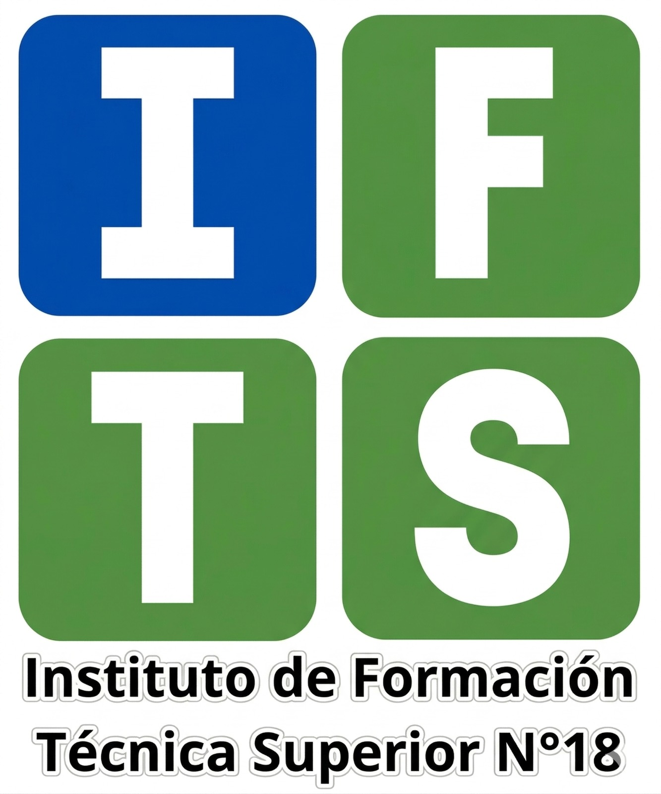
  

## Instituto de Formación Técnica Superior N°18

**Institución:** IFTS 18  
**Carrera:** Técnico Superior en Desarrollo de Software  
**Profesor:** Lucas Rusatti  
**Grupo:** D

  
## 👥 Integrantes

* **Diego Murgana** 
* **Leandro Sosa**
* **Agustín Senin**
* **Santiago Padilla**  

  

## 📍 Índice de Contenidos

| N° | Pregunta | N° | Pregunta | N° | Pregunta |
|:---:|:---|:---:|:---|:---:|:---|
| 1 | [¿Qué es una VLAN?](#1-qué-es-una-vlan) | 12 | [Tecnologías Wireless](#12-tecnologías-wireless-y-sus-estándares) | 23 | [Microsoft Teams](#23-explique-la-solución-de-microsoft-teams) |
| 2 | [¿Qué es una VPN?](#2-qué-es-una-vpn) | 13 | [¿Qué es un Proxy?](#13-qué-es-un-proxy) | 24 | [Calidad en enlace MPLS](#24-qué-significa-aplicar-calidad-en-un-enlace-mpls) |
| 3 | [¿Qué es una SAN?](#3-qué-es-una-san) | 14 | [Protocolo Spanning Tree](#14-protocolo-spanning-tree) | 25 | [Coaxial, UTP y Fibra](#25-diferencias-entre-coaxial-utp-y-fibra) |
| 4 | [Hub, Repetidor, Router y Switch](#4-diferencias-entre-un-hub-repetidor-router-y-switch) | 15 | [Protocolo OSPF](#15-protocolo-de-comunicaciones-ospf) | 26 | [Certificaciones Cisco](#26-según-cisco-qué-significa-ccent-ccna-y-ccnp) |
| 5 | [Protocolo de Comunicaciones](#5-qué-es-un-protocolo-de-comunicaciones) | 16 | [Protocolo ARP](#16-protocolo-arp) | 27 | [Modelo OSI](#27-explique-el-modelo-osi) |
| 6 | [TCP/IP y NetBios](#6-explique-tcpip-y-netbios-resuma-sus-diferencias) | 17 | [¿Qué es un Firewall?](#17-qué-es-un-firewall) | 28 | [Estándar IEEE 802.3](#28-estándar-ieee-8023) |
| 7 | [Paquete TCP/IP y Flags](#7-cómo-está-formado-un-paquete-de-datos-en-tcpip-qué-es-un-flag) | 18 | [¿Qué es una DMZ?](#18-qué-es-una-dmz) | 29 | [Estándar IEEE 802.4](#29-estándar-ieee-8024) |
| 8 | [Red según Geografía](#8-defina-la-red-según-su-geografía-explicar-distintas-variantes) | 19 | [¿Qué es un Gateway?](#19-qué-es-un-gateway) | 30 | [Protocolos de correo](#30-protocolos-para-enviar-y-recibir-correo) |
| 9 | [Red según Topología](#9-defina-una-red-según-su-topología-explicar-distintas-variantes) | 20 | [¿Qué significa NBL?](#20-según-microsoft-qué-significa-nbl) | 31 | [Protocolo para leer correo](#31-protocolo-para-leer-correo-recibido) |
| 10 | [Servicio DHCP](#10-explicar-el-servicio-de-dhcp) | 21 | [Tipos de enlace](#21-tipos-de-enlace-mpls-lan-to-lan-microonda-vsat) | 32 | [IPv4 vs IPv6](#32-diferencias-entre-ipv4-e-ipv6) |
| 11 | [Servicio DNS](#11-explicar-el-servicio-de-dns) | 22 | [Tecnología LTE](#22-describir-la-tecnología-lte) | 33 | [Experiencia Personal](#33-experiencia-en-redes-por-integrante) |

  

# 📖 Desarrollo del Cuestionario

## 1. ¿Qué es una VLAN?

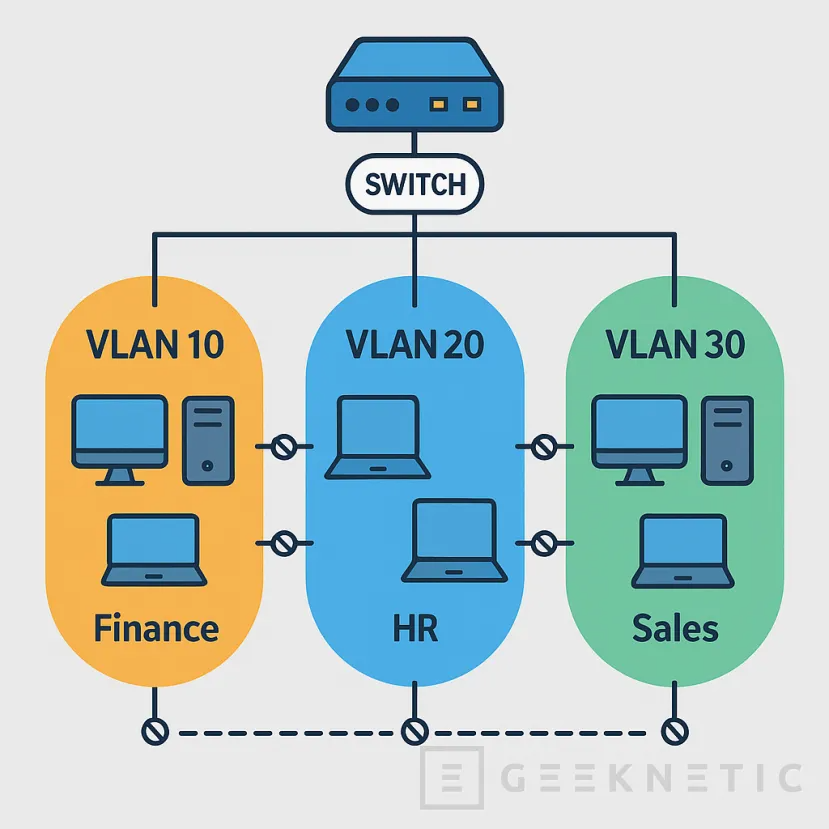

Una **VLAN** (Virtual Local Area Network) es una tecnología que nos permite dividir un único switch físico en varias redes lógicas independientes. En lugar de tener que comprar un equipo para cada sector de una empresa, usamos el software del switch para segmentar y organizar el tráfico de datos de manera inteligente.

Como podemos observar en la imagen, el mismo switch físico está repartiendo la conexión para distintos departamentos. Gracias a esta configuración, la **VLAN 10 (Finanzas)** se mantiene totalmente aislada de la **VLAN 30 (Ventas)**. Esto significa que, aunque todos los cables lleguen al mismo aparato, los datos de un grupo no se "ven" ni se mezclan con los del otro.

Según la bibliografía de **Cisco**, esta separación optimiza el rendimiento y la seguridad de la red por tres motivos principales:

* **Seguridad:** Un usuario en la red de Ventas no puede acceder a los servidores de Finanzas si no hay un permiso de ruteo explícito.
* **Orden y Rendimiento:** Si un sector está saturando la red con archivos pesados, ese tráfico no afecta la velocidad de los demás sectores.
* **Flexibilidad:** Si un empleado se muda de oficina, simplemente se cambia la configuración de su boca de red en el switch sin necesidad de tirar cables nuevos.

<a href="#-índice-de-contenidos">⬆ Volver al Índice</a>

---

## 2. ¿Qué es una VPN?

Una **VPN** (Virtual Private Network o Red Privada Virtual) es una tecnología que permite extender una red privada sobre una red pública como Internet. Su función principal es crear un canal de comunicación seguro, permitiendo que los datos viajen protegidos como si estuviéramos conectados físicamente a la red de nuestra propia oficina, sin importar la distancia geográfica.

Para entenderlo de forma sencilla, si Internet es una autopista pública, una VPN funciona como un **túnel privado y blindado** construido dentro de esa autopista. Solo los dispositivos autorizados pueden entrar en ese túnel, y todo lo que pasa por dentro viaja cifrado (oculto) para que nadie desde afuera pueda interceptar o leer la información privada de la empresa.
  

  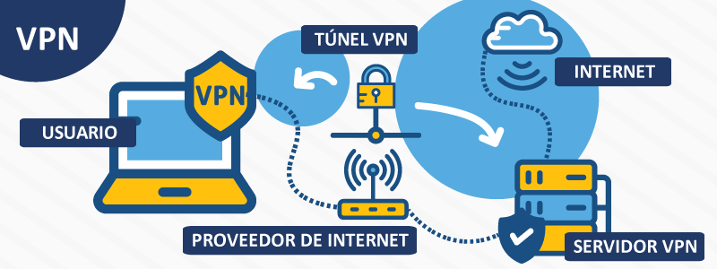
   
  <i>Diagrama de una conexión remota segura a través de un túnel VPN.</i>

  

Según la bibliografía de **Cisco**, una VPN garantiza la operatividad y seguridad mediante dos pilares fundamentales:

* **Cifrado de Datos:** La información se codifica mediante algoritmos matemáticos antes de salir del dispositivo, volviéndose ilegible para cualquier atacante en la red pública.
* **Acceso Remoto Transparente:** Permite que un empleado trabaje desde su casa o cualquier sitio remoto accediendo a los recursos internos (servidores de archivos, bases de datos o sistemas de gestión) de manera privada y confiable.

<a href="#-índice-de-contenidos">⬆ Volver al Índice</a>

---

## 3. ¿Qué es una SAN?

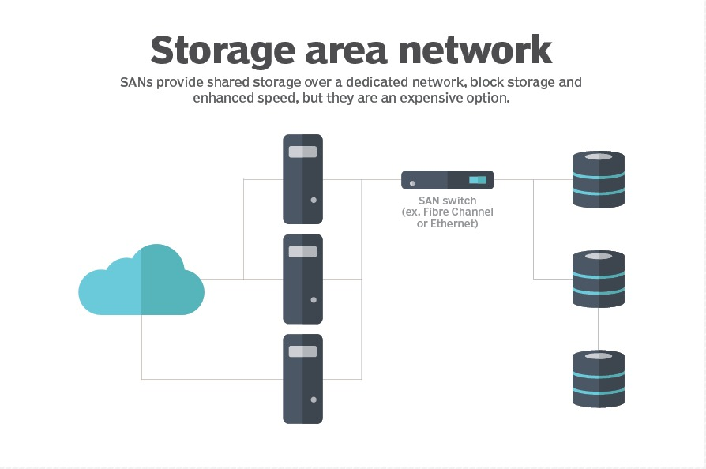

Una **SAN** (Storage Area Network o Red de Área de Almacenamiento) es una red de alta velocidad diseñada exclusivamente para conectar servidores con dispositivos de almacenamiento, como sistemas de discos o librerías de cintas. A diferencia de conectar un disco rígido directamente a una computadora, la SAN crea un entorno donde el almacenamiento es un recurso compartido y centralizado que funciona de forma independiente a la red de los usuarios.

Como se observa en el diagrama, la SAN actúa como una "nube de discos" privada. Según la bibliografía de **Cisco**, esto permite que los servidores vean estos discos remotos como si estuvieran físicamente instalados dentro de ellos (almacenamiento a nivel de bloque). Es la solución preferida en entornos profesionales porque el tráfico pesado de datos viaja por cables propios, sin saturar la red local (LAN) de la empresa.
  

**Las principales ventajas de implementar una SAN en una infraestructura son:**

* **Alta Disponibilidad:** Si un servidor falla, los datos permanecen intactos en la SAN y pueden ser conectados a otro servidor en segundos.
* **Consolidación y Eficiencia:** En lugar de tener gigas desperdiciados en distintos servidores, todo el espacio se administra desde un solo equipo (Storage), repartiéndolo según la necesidad.
* **Escalabilidad:** Permite agregar discos masivamente sin tener que apagar los servidores ni desarmar los equipos existentes.

<a href="#-índice-de-contenidos">⬆ Volver al Índice</a>

---

## 4. Diferencias entre un Hub, Repetidor, Router y Switch

Para comprender cómo se estructura una red, es fundamental distinguir la inteligencia y la función de cada dispositivo. Como se observa en el gráfico, existen diversos componentes que trabajan en conjunto para permitir la comunicación:

* **Repetidor:** Es el dispositivo más sencillo. Su única función es recibir una señal débil y regenerarla para extender su alcance físico, sin analizar el contenido de los datos.
* **Hub (Concentrador):** Funciona como un punto de conexión central, pero carece de inteligencia. Todo lo que recibe por un puerto lo reenvía a todos los demás, lo que suele generar "colisiones" y saturar la red innecesariamente.
* **Switch (Conmutador):** Es la evolución del Hub. Según la guía de **Cisco**, el switch identifica las direcciones físicas (MAC) de cada equipo conectado. De esta forma, entrega los datos solo al destinatario correcto, permitiendo que varios equipos hablen a la vez sin interferencias.
* **Router (Enrutador):** Es el "cerebro" que conecta diferentes redes entre sí (como nuestra LAN con Internet). Decide cuál es el mejor camino para que la información llegue a su destino.

  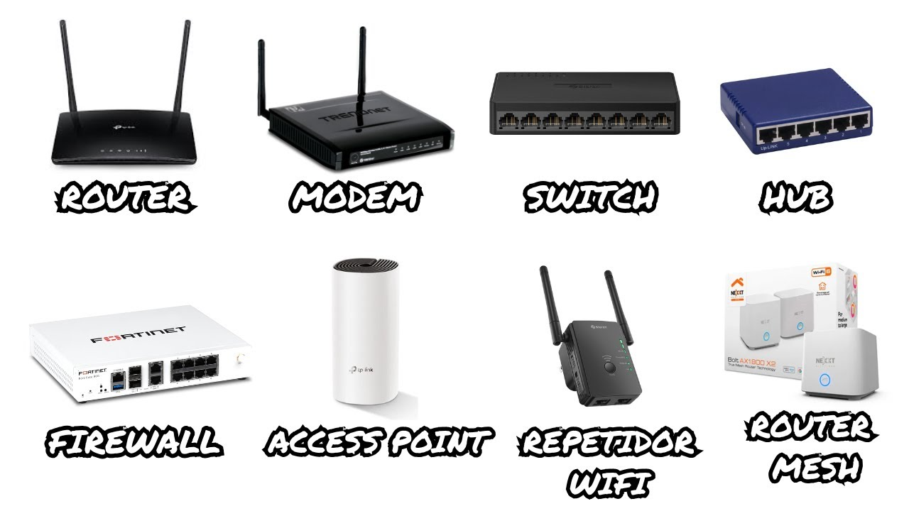
   
  <i>Dispositivos de Red.</i>

  

Además, en el esquema podemos ver otros componentes vitales como el **Firewall**, que actúa como una barrera de seguridad contra amenazas externas, el **Access Point** para brindar conectividad inalámbrica, y el **Módem**, que es el encargado de traducir las señales de nuestro proveedor de internet (ISP) para que el Router pueda distribuirlas.

<a href="#-índice-de-contenidos">⬆ Volver al Índice</a>

---

## 5. ¿Qué es un protocolo de comunicaciones?

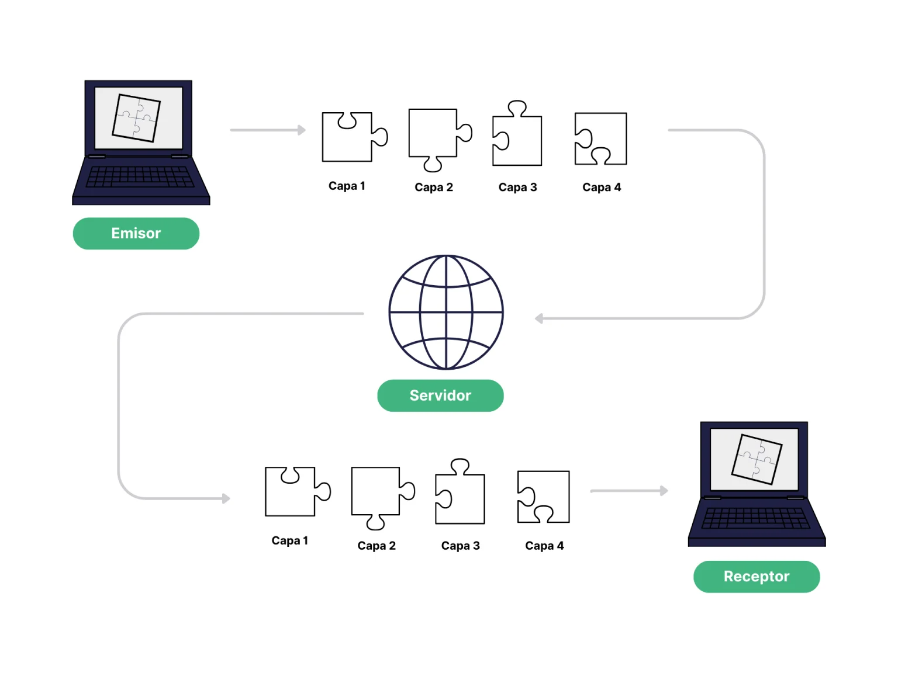

En el mundo de las redes, un **protocolo de comunicaciones** es un conjunto de reglas y normas que permiten que dos o más dispositivos se entiendan y compartan información. Si comparamos una red con una charla entre personas, el protocolo sería el idioma y las reglas de cortesía: no importa qué tan buenos sean los teléfonos (el hardware), si no se utiliza el mismo idioma y no se respetan los turnos para hablar, la comunicación fracasará.

Como se ilustra en el esquema, el protocolo actúa como el medio que garantiza que el mensaje llegue correctamente del emisor al receptor. Según explica **Tanenbaum**, este acuerdo define tres aspectos fundamentales:

* **Sintaxis:** Cómo se estructuran los datos (el formato del paquete).
* **Semántica:** Qué significa cada sección de la información enviada.
* **Temporización:** A qué velocidad se deben enviar los datos y cómo se sincronizan ambos equipos.

En resumen, los protocolos son el "reglamento" que garantiza que el flujo de datos sea ordenado, seguro y universal, permitiendo que equipos de diferentes marcas en todo el mundo se conecten entre sí sin problemas.

<a href="#-índice-de-contenidos">⬆ Volver al Índice</a>

---

## 6. Explique TCP/IP y NetBios, resuma sus diferencias

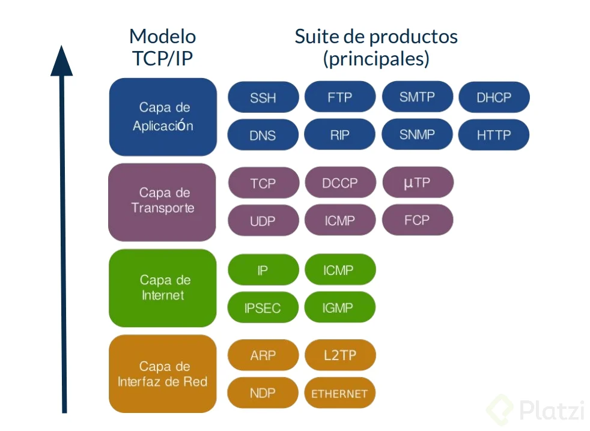

Para entender las redes modernas y las antiguas, debemos diferenciar entre el estándar global **TCP/IP** y el sistema de nombres **NetBIOS**:

* **TCP/IP (Transmission Control Protocol/Internet Protocol):** Es el lenguaje universal de Internet. Como se observa en la imagen de la **Suite de Protocolos**, no es un solo protocolo sino una arquitectura de capas. Según **Cisco**, su gran ventaja es que es "enrutable": permite que los datos viajen a través de múltiples routers hasta llegar a cualquier parte del mundo usando direcciones numéricas (IP). Es robusto, escala a redes gigantescas y garantiza que la información llegue sin errores.

* **NetBIOS (Network Basic Input/Output System):** Es un protocolo mucho más antiguo, desarrollado originalmente para redes locales (LAN) pequeñas. A diferencia de TCP/IP, NetBIOS no usa números, sino **nombres de hasta 15 caracteres** para identificar a las computadoras (ejemplo: `PC-CONTABILIDAD`). Su limitación principal es que no es enrutable; es decir, los mensajes de NetBIOS no pueden salir de la oficina hacia Internet por sí solos.

**Diferencia fundamental:**
Mientras que TCP/IP es el motor que mueve los datos por todo el planeta, NetBIOS es un sistema de nombres simplificado. Hoy en día, NetBIOS casi no se usa solo, sino que corre "encapsulado" dentro de TCP/IP (NetBIOS sobre TCP/IP) para que podamos seguir viendo los nombres de los equipos en Windows pero usando la potencia y el alcance de Internet.

<a href="#-índice-de-contenidos">⬆ Volver al Índice</a>

---

## 7. ¿Cómo está formado un paquete de datos en TCP/IP? ¿Qué es un Flag?

En el modelo TCP/IP, la información no viaja como un bloque único, sino fragmentada en unidades llamadas **paquetes** (o segmentos en la capa de transporte). Un paquete está formado principalmente por dos secciones: el **Encabezado (Header)**, que contiene las instrucciones de manejo, y los **Datos (Payload)**, que es la información real que queremos transmitir.

  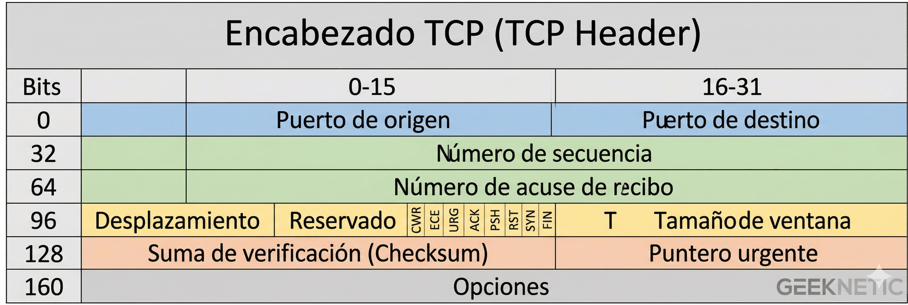
   
  <i>Estructura técnica de un encabezado TCP agrupados por colores.</i>

Como se puede observar en la tabla técnica superior, el encabezado contiene datos críticos para que la comunicación sea exitosa, representados por colores:
* **Azul:** Contiene los **Puertos**, que identifican la aplicación que envía y la que recibe.
* **Verde:** Incluye los **Números de Secuencia**, fundamentales para reordenar los datos al llegar.
* **Amarillo:** Es la sección de Control y Gestión, donde **residen los Flags** y el Tamaño de Ventana para coordinar el flujo de la comunicación.
* **Naranja:** Tiene la **Suma de Verificación (Checksum)**, que asegura que el paquete no se dañó.

#### ¿Qué es un Flag?
Dentro del encabezado, específicamente en la sección **amarilla** (donde se ven las siglas CWR, ECE, URG, ACK, PSH, RST, SYN, FIN), encontramos los **Flags** (banderas). Según la bibliografía de **Cisco**, los Flags son indicadores de un solo bit que funcionan como "señales de control" entre los dispositivos.

Funcionan como un lenguaje de señas para gestionar la conexión. Los más importantes son:
* **SYN (Synchronize):** "Hola, ¿querés iniciar una conexión?".
* **ACK (Acknowledgment):** "Recibido, confirmo que me llegó el paquete".
* **FIN (Finish):** "Ya no tengo más nada para enviar, cerremos la conexión".

En resumen, si el paquete es un sobre, el encabezado es la etiqueta con la dirección y los **Flags** son marcas especiales que indican si el envío es urgente o si requiere un acuse de recibo obligatorio.

<a href="#-índice-de-contenidos">⬆ Volver al Índice</a>

---

## 8. Defina la red según su geografía. Explicar distintas variantes.

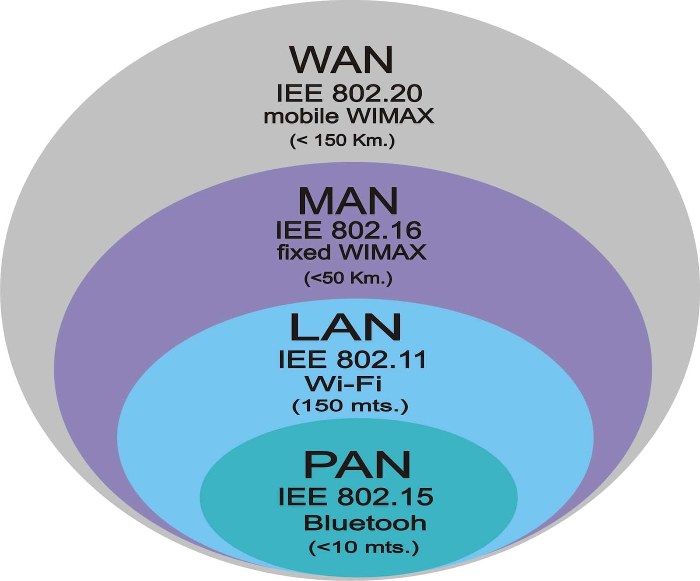

La clasificación geográfica de las redes determina el alcance físico y las tecnologías necesarias para establecer la comunicación. Según la bibliografía de **Tanenbaum**, las redes se categorizan principalmente por la distancia que cubren:

* **PAN (Personal Area Network):** Como se observa en la base del gráfico, son redes de muy corto alcance (menos de 10 metros). El ejemplo más común es el **Bluetooth** (estándar IEEE 802.15) que conecta dispositivos personales.
* **LAN (Local Area Network):** Cubre áreas pequeñas como una casa o una oficina. Suelen usar tecnologías **Wi-Fi** (IEEE 802.11) o cables Ethernet, con un alcance típico de hasta 150 metros.
* **MAN (Metropolitan Area Network):** Diseñada para conectar diversas LAN en una ciudad o municipio, con un alcance de hasta 50 km. Utiliza tecnologías como WiMAX fijo para cubrir grandes áreas urbanas.
* **WAN (Wide Area Network):** Es la red de área amplia que conecta países o continentes. Internet es el ejemplo máximo. Utiliza infraestructuras complejas, satélites y cables submarinos para cubrir distancias superiores a los 150 km.

**Dato clave:** A medida que la red crece en geografía, la administración se vuelve más compleja y suele requerir de proveedores externos (ISP) para mantener la infraestructura de conexión.

<a href="#-índice-de-contenidos">⬆ Volver al Índice</a>

---

## 9. Defina una red según su topología. Explicar distintas variantes.

La **topología de red** define la estructura o diseño de la misma. Según **Tanenbaum**, debemos distinguir entre la **topología física** (cómo están conectados los cables y dispositivos) y la **topología lógica** (cómo fluyen realmente los datos por la red). Elegir la topología adecuada impacta directamente en el rendimiento, la escalabilidad y la tolerancia a fallos del sistema.
  

  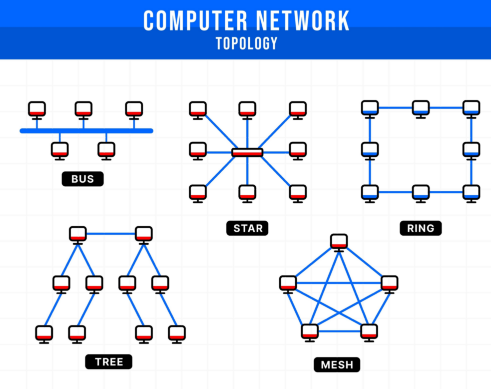
   
  <i>Representación visual de las topologías de red más comunes: Bus, Estrella, Anillo, Árbol y Malla.</i>

  

A continuación, se explican las variantes principales que se observan en el gráfico:

* **Topología en Bus:** Todos los dispositivos están conectados a un único cable central (el "bus" o "troncal"). La información viaja en ambas direcciones.
    * **Ventaja:** Fácil y económica de instalar en redes pequeñas.
    * **Desventaja:** Si el cable principal falla, toda la red pierde conectividad. Existe una alta probabilidad de colisiones de datos.

* **Topología en Estrella (Star):** Todos los nodos están conectados a un dispositivo central (un Switch o un Hub). Todo el tráfico pasa obligatoriamente por este centro. Es la más común en redes LAN actuales.
    * **Ventaja:** Si un cable falla, solo ese nodo específico pierde conexión. Es fácil de administrar y de aislar problemas.
    * **Desventaja:** Si el dispositivo central falla, toda la red se interrumpe.

* **Topología en Anillo (Ring):** Cada dispositivo está conectado exactamente a otros dos, formando un círculo cerrado. Los datos viajan en una sola dirección pasando por cada nodo hasta llegar a su destino.
    * **Ventaja:** El rendimiento no decae drásticamente cuando hay mucho tráfico (comparado con la topología en Bus).
    * **Desventaja:** La falla de un nodo o de un cable puede romper el anillo y detener la red.

* **Topología en Malla (Mesh):** Cada nodo está conectado a todos los demás nodos de la red (Malla Completa) o al menos a varios de ellos (Malla Parcial).
    * **Ventaja:** Alta redundancia y tolerancia a fallos. Si un enlace cae, los datos toman otro camino alternativo.
    * **Desventaja:** Es muy costosa y compleja de cablear en su forma física, aunque es el estándar de facto para redes inalámbricas (Mesh Wi-Fi) y el diseño central de Internet.

* **Topología en Árbol (Tree) o Jerárquica:** Es una combinación de estrella y bus. Los nodos están conectados a switches que forman estrellas, y estos switches están conectados a un switch central o troncal, ramificándose de manera estructurada. Es la forma en que se organizan las redes empresariales modernas según las guías de diseño de **Cisco**.

<a href="#-índice-de-contenidos">⬆ Volver al Índice</a>

---

## 10. Explicar el servicio de DHCP

El **DHCP** (Dynamic Host Configuration Protocol) es un protocolo de tipo cliente-servidor que asigna automáticamente direcciones IP y otros parámetros de configuración. Según la bibliografía de **Cisco**, su objetivo principal es eliminar los errores humanos y la duplicación de direcciones en la red, facilitando la administración.

**¿Qué información entrega?**
Además de la dirección IP única, el servidor proporciona los datos necesarios para que el equipo pueda navegar y localizar otros servicios:
* **Máscara de subred:** Define el segmento de red.
* **Puerta de enlace predeterminada (Gateway):** La salida hacia otras redes o Internet.
* **Direcciones de servidores DNS:** Para traducir nombres de dominio en direcciones IP.

**Funcionamiento: El proceso D.O.R.A.**
Cuando un dispositivo se conecta a la red, se inicia una negociación de cuatro pasos fundamentales:

| Paso | Mensaje | Emisor | Acción |
| :--- | :--- | :--- | :--- |
| **1** | **Discover** (Descubrir) | Cliente | El equipo busca un servidor DHCP enviando un mensaje a toda la red (Broadcast). |
| **2** | **Offer** (Ofrecer) | Servidor | El servidor responde ofreciendo una IP disponible y el tiempo de concesión (Lease time). |
| **3** | **Request** (Solicitar) | Cliente | El equipo acepta la oferta y solicita formalmente el uso de esa IP específica. |
| **4** | **Acknowledge** (Confirmar) | Servidor | El servidor confirma la asignación, registra la IP como ocupada y autoriza su uso. |

> **Dato extra:** Es útil saber que si este proceso falla, los sistemas operativos suelen auto-asignarse una dirección **APIPA** (169.254.x.x), lo que indica que el dispositivo tiene conexión física pero no logró obtener una configuración válida del servidor DHCP.

<a href="#-índice-de-contenidos">⬆ Volver al Índice</a>

---

## 11. Explicar el servicio de DNS

El **DNS** (Domain Name System) es un sistema de nomenclatura jerárquico que funciona como la **"agenda telefónica" de Internet**. Su función principal es traducir nombres de dominio legibles para los humanos (como `www.google.com`) en direcciones IP numéricas que las computadoras utilizan para comunicarse (como `142.250.190.46`).

**¿Por qué es necesario?**
Porque para nosotros es mucho más fácil recordar una palabra que una secuencia de números. Sin DNS, para entrar a una página web deberíamos escribir su dirección IP exacta en el navegador.

**¿Cómo es el proceso de resolución?**
Cuando escribís una dirección en el navegador, ocurre una búsqueda rápida en varios niveles:

1. **Caché Local:** Tu computadora primero se fija si ya conoce esa dirección porque la visitaste antes.
2. **Servidor DNS del ISP:** Si no la conoce, le pregunta a tu proveedor de internet (como si fuera un bibliotecario).
3. **Búsqueda Jerárquica:** Si nadie sabe la respuesta, se inicia una consulta por niveles:
    * **Servidores Raíz:** Indican quién maneja los `.com`, `.org`, `.ar`, etc.
    * **Servidores TLD:** Indican quién es el dueño del nombre (ejemplo: `google.com`).
    * **Servidor Autoritativo:** Es el que tiene la "verdad absoluta" y entrega la IP final al navegador.

> **Dato extra:** Es vital entender que cuando cambiás el servidor donde alojás una web, el DNS puede tardar hasta 24 o 48 horas en "avisarle" a todo el mundo el cambio de dirección. A esto se le llama **Propagación DNS**.

<a href="#-índice-de-contenidos">⬆ Volver al Índice</a>

---

## 12. Tecnologías Wireless y sus estándares

Las tecnologías **Wireless** permiten la conexión entre dispositivos mediante ondas de radio, eliminando la necesidad de cables físicos. La tecnología reina en nuestras casas y oficinas es el **Wi-Fi**, regulado por el instituto **IEEE** bajo la norma **802.11**.

**¿Cómo evolucionó el Wi-Fi?**
Para entenderlo fácil, podemos ver cómo cada generación mejoró la velocidad y la capacidad de manejar muchos dispositivos a la vez:

| Generación | Estándar | Frecuencia | Velocidad Típica | Lo importante |
| :--- | :--- | :--- | :--- | :--- |
| **Wi-Fi 4** | 802.11n | 2.4 y 5 GHz | Hasta 600 Mbps | Introdujo varias antenas (MIMO) para mayor alcance. |
| **Wi-Fi 5** | 802.11ac | 5 GHz | +1 Gbps | Mucho más rápido, ideal para streaming de video. |
| **Wi-Fi 6/6E**| 802.11ax | 2.4, 5 y 6 GHz| Hasta 9.6 Gbps | Diseñado para lugares con muchísima gente conectada. |
| **Wi-Fi 7** | 802.11be | 2.4, 5 y 6 GHz| Hasta 46 Gbps | Enfocado en latencia cero y video 8K (El más nuevo). |

**Conceptos clave extraídos de Cisco:**
* **Bandas de Frecuencia:** La de **2.4 GHz** es como una calle vieja: llega lejos pero es lenta y está llena de baches (interferencias de microondas o Bluetooth). La de **5 GHz** y **6 GHz** son como autopistas nuevas: son mucho más rápidas pero atraviesan peor las paredes.
* Al ser un medio compartido (el aire), si muchos vecinos usan el mismo canal, la red se vuelve lenta. Por eso los estándares modernos como Wi-Fi 6 usan **OFDMA**, que permite que el router hable con varios dispositivos al mismo tiempo sin esperar turno, es decir que hace el router es gestionar mejor el espacio que ya tiene en la frecuencia.

> **Dato extra:** Recordá que aunque el Wi-Fi diga "46 Gbps", esa es una velocidad teórica. En la práctica, la velocidad real siempre es menor debido a las paredes, la distancia y cuántos dispositivos estén "gritando" en el aire al mismo tiempo.

<a href="#-índice-de-contenidos">⬆ Volver al Índice</a>

---

## 13. ¿Qué es un Proxy?

Un **Proxy** es un servidor que actúa como un **intermediario** entre tu computadora y el resto de Internet. En lugar de conectarte directamente a una página web, tu solicitud pasa primero por el Proxy, quien hace el pedido por vos.

**¿Para qué se utiliza en las organizaciones?**
Según la bibliografía de **Cisco**, un Proxy es una herramienta vital por cuatro razones principales:

* **Seguridad y Filtrado:** Es el "portero" de la red. Puede bloquear redes sociales o sitios peligrosos para que nadie en la oficina pueda entrar.
* **Anonimato:** Como el Proxy es quien hace el pedido, los sitios web solo ven la dirección IP del Proxy y no la tuya. Esto oculta tu ubicación real.
* **Caché (Ahorro de Internet):** Si 50 personas entran a ver la misma noticia, el Proxy la descarga una sola vez y se la reparte a todos. Esto hace que internet se sienta mucho más rápido.
* **Proxy Inverso (Reverse Proxy):** Es como el anterior pero al revés. Se pone "adelante" de los servidores de una empresa para protegerlos de ataques externos y repartir el trabajo entre varios servidores (Balanceo de carga).

| Tipo de Proxy | Dirección del flujo | Objetivo Principal |
| :--- | :--- | :--- |
| **Proxy Directo** | Cliente → Internet | Proteger al usuario y filtrar contenido. |
| **Proxy Inverso** | Internet → Servidor | Proteger al servidor y balancear carga. |

> **Dato extra:** Tené en cuenta que cuando navegás "de incógnito" no estás usando un Proxy; tu IP sigue siendo visible. Para ocultarla realmente, necesitás un Proxy o una VPN. El Proxy Inverso lo vas a usar mucho cuando despliegues aplicaciones (como usando **Nginx**) para manejar el tráfico de tus usuarios.

<a href="#-índice-de-contenidos">⬆ Volver al Índice</a>

---

## 14. Protocolo Spanning Tree

El **STP** (Spanning Tree Protocol) es un protocolo de Capa 2 (Enlace de Datos) definido por el estándar **IEEE 802.1D**. Su función principal es **evitar bucles (loops) lógicos** en redes que tienen cables redundantes.

**¿Por qué es vital?**
En redes profesionales, conectamos los switches con más de un cable por si alguno se rompe (redundancia). Sin STP, los datos de difusión (broadcast) darían vueltas en círculos entre los switches para siempre, creando una **tormenta de broadcast** que colapsaría la red en segundos.

**¿Cómo funciona el proceso?**
Según la bibliografía de **Cisco**, el protocolo convierte una red con cables en círculo en un "árbol" donde no hay vueltas:

1. **Elección del Root Bridge (Puente Raíz):** Los switches eligen a un "jefe" o punto central de la red.
2. **Cálculo de rutas:** Cada switch busca el camino más rápido (menor costo) para llegar a ese "jefe".
3. **Bloqueo de puertos:** STP apaga lógicamente los cables que sobran. Esos cables quedan "en reserva" pero no pasan datos.

 **¿Qué pasa si falla un cable?** 
Si el cable principal se corta, el STP detecta la falla en milisegundos y **habilita automáticamente** el puerto que estaba bloqueado. Esto garantiza que la red nunca se caiga, sin necesidad de que un humano intervenga. 

<a href="#-índice-de-contenidos">⬆ Volver al Índice</a>

---

## 15. Protocolo de comunicaciones OSPF

El **OSPF** (Open Shortest Path First) es un protocolo de enrutamiento dinámico de Capa 3 (Red). Según la bibliografía de **Cisco**, es el estándar para redes empresariales grandes porque es capaz de encontrar la ruta más eficiente para los datos en tiempo real.

**¿Cómo funciona?**
A diferencia de protocolos más simples, OSPF es inteligente y se basa en el **Estado de Enlace**:

* **Mapa Completo:** Cada router tiene un mapa exacto de toda la red (base de datos topológica). No solo sabe quién es su vecino, sino cómo está conectada toda la empresa.
* **Algoritmo de Dijkstra:** OSPF usa este famoso algoritmo matemático para calcular el camino más rápido. El "costo" de una ruta se basa en el **ancho de banda**: prefiere una autopista de 100km aunque dé más vueltas, antes que un camino de tierra de 10km.
* **Segmentación por Áreas:** En redes gigantes, OSPF divide la red en "Áreas" para no saturar los equipos. El **Área 0** (Backbone) es el corazón de la red por donde debe pasar todo el tráfico entre zonas.

**Ventajas principales:**
* **Convergencia rápida:** Si un cable se corta, todos los routers se enteran al instante y recalculan una ruta alternativa en milisegundos.
* **Escalabilidad:** Puede manejar redes con cientos de routers sin perder eficiencia.
  

> **Dato extra:** Un backbone Es la línea de conexión principal de una red, diseñada para manejar el mayor volumen de tráfico y unir diferentes partes de una infraestructura (como pisos de un edificio, sucursales de una empresa o incluso continentes).

<a href="#-índice-de-contenidos">⬆ Volver al Índice</a>

---

## 16. Protocolo ARP

### 16. Protocolo ARP (Address Resolution Protocol)

El **ARP** es un protocolo fundamental que actúa como puente entre la **Capa 3** (Red - Direcciones IP) y la **Capa 2** (Enlace - Direcciones MAC). Según la bibliografía de **Tanenbaum**, su función es permitir que un equipo encuentre la dirección física de otro dispositivo dentro de la misma red local.

**¿Por qué es necesario?**
Aunque nosotros usamos direcciones IP para navegar, los switches de la red no entienden de IPs; ellos solo saben entregar datos basados en la **dirección MAC** grabada en la tarjeta de red de cada equipo. El ARP es el encargado de hacer esa traducción.

**¿Cómo funciona el proceso?**
Cuando tu computadora quiere hablar con otra pero no conoce su dirección física, sigue estos pasos:

1. **ARP Request (La pregunta):** Tu equipo envía un mensaje a toda la red (Broadcast) diciendo: *"¿Quién tiene la IP 192.168.1.50? Pasame tu dirección MAC"*.
2. **ARP Reply (La respuesta):** Todos escuchan, pero solo el dueño de esa IP responde: *"Soy yo, mi MAC es 00:1A:2B:3C:4D:5E"*.
3. **Caché ARP:** Tu equipo guarda esa respuesta en una tabla temporal (memoria caché) para no tener que volver a preguntar cada vez que necesite enviar datos.

#

**Resumen de flujo:**
* **IP:** Es "quién" es el destinatario (Lógico).
* **MAC:** Es "dónde" está el destinatario (Físico).
* **ARP:** Es el que une ambos datos.

<a href="#-índice-de-contenidos">⬆ Volver al Índice</a>

---

## 17. ¿Qué es un Firewall?

Un **Firewall** es un sistema de seguridad de red diseñado para monitorizar y controlar el tráfico entrante y saliente. Según la bibliografía de **Cisco**, actúa como una barrera entre una red de confianza (como tu red privada) y redes externas no confiables (como Internet).

  

  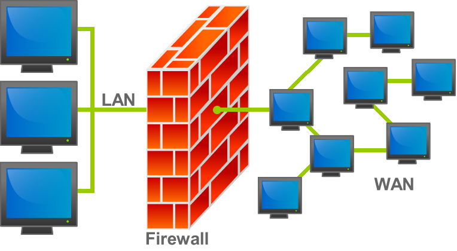

  

**¿Cómo funciona?**
El firewall aplica un conjunto de **reglas de seguridad** predefinidas. Cuando un dato intenta cruzar el muro, el firewall revisa:
* **Origen y Destino:** De qué dirección IP viene y a cuál quiere ir.
* **Puerto:** Qué tipo de servicio está pidiendo (por ejemplo, el puerto 80 para web o el 25 para mails).
* **Protocolo:** Si es una comunicación permitida (TCP, UDP, ICMP, etc.).

**Tipos principales:**
1. **Firewall de Software:** Aplicaciones que corren en tu propia PC (como el firewall de Windows o `ufw` en tu Linux Mint).
2. **Firewall de Hardware:** Dispositivos físicos que se colocan entre el router y el resto de la red corporativa para proteger a todos los equipos al mismo tiempo.

> **Dato extra:** En el desarrollo de software, es muy común que una aplicación "no funcione" porque el firewall está bloqueando el puerto que usa tu servidor local (como el puerto 8080 o el 3000). Saber configurar reglas de entrada y salida es una habilidad básica para cualquier programador.

<a href="#-índice-de-contenidos">⬆ Volver al Índice</a>

---
## 18. ¿Qué es una DMZ?

Una **DMZ** es una subred física o lógica que funciona como una **zona intermedia** entre la red interna de una organización (segura) y una red externa desprotegida (como Internet). Su objetivo es permitir que usuarios externos accedan a ciertos servicios sin poner en riesgo la seguridad de la red privada.

**¿Qué se coloca en una DMZ?**
Allí se ubican los servidores que necesitan ser vistos desde el exterior:
* **Servidores Web (HTTP/HTTPS):** Para que el público vea la página de la empresa.
* **Servidores de Correo (SMTP):** Para recibir e-mails externos.
* **Servidores DNS públicos:** Para resolver nombres de dominio.

**¿Cómo funciona la seguridad?**
Generalmente se utiliza una configuración de **doble firewall**:
1. **Firewall Externo:** Permite el tráfico desde Internet solo hacia la DMZ.
2. **Firewall Interno:** Bloquea todo el tráfico que viene de la DMZ hacia la red interna de la empresa.

> **Dato extra:**
> Como desarrollador, si estás trabajando en una aplicación que debe ser pública, lo más probable es que tu servidor se despliegue en una DMZ. Si tu app necesita consultar una base de datos privada, tendrás que pedirle al administrador de redes que abra un "agujero" específico en el firewall interno para que esa comunicación sea posible.

<a href="#-índice-de-contenidos">⬆ Volver al Índice</a>

---
## 19. ¿Qué es un Gateway?

Un **Gateway** es un dispositivo o software que actúa como punto de enlace entre redes que utilizan diferentes protocolos o arquitecturas. Según la bibliografía de **Cisco**, su función principal es actuar como un "traductor" para que los datos puedan salir de una red local hacia una red externa.

**¿Por qué es fundamental?**
En una red doméstica o empresarial, el router suele cumplir la función de **Default Gateway** (Puerta de enlace predeterminada). 
* Si enviás un archivo a una PC que está en tu misma red, los datos viajan directo por el Switch.
* Si intentás entrar a una web, tu computadora se da cuenta de que el destino es externo y le entrega el paquete al **Gateway** para que él se encargue de enviarlo al mundo.

**Diferencia clave:**
* **Router:** Es el equipo físico que encamina los paquetes.
* **Gateway:** Es la función de "puerta" que permite la comunicación entre redes con lenguajes o reglas distintas.

> **Dato extra:**
> Seguramente en tus clases de redes viste la configuración IP: `IP: 192.168.1.10`, `Subnet: 255.255.255.0`, `Gateway: 192.168.1.1`. Ese último número es la dirección privada de tu router. Si borrás ese dato, tu computadora quedará aislada de Internet instantáneamente.

<a href="#-índice-de-contenidos">⬆ Volver al Índice</a>

---

## 20. Según Microsoft, ¿qué significa NBL?

En el ecosistema de **Microsoft**, el término **NBL** (Network-Based Licensing) se refiere a un modelo de **licenciamiento basado en la red**. Es un sistema diseñado para empresas que necesitan gestionar grandes volúmenes de software de manera centralizada.

**¿Cómo funciona?**
En lugar de ingresar una clave de producto en cada computadora individual, el proceso se automatiza:
1. **Servidor de Licencias:** La empresa instala un servidor central que "guarda" todas las licencias compradas.
2. **Validación en Red:** Cuando un usuario inicia el software (como Office o Windows), el programa se comunica a través de la red local con el servidor para validar su estado.
3. **Gestión Dinámica:** Si un empleado deja la empresa o cambia de PC, la licencia vuelve al servidor automáticamente para que la use otro, sin perder el rastro del activo.

**Ventajas principales:**
* **Control centralizado:** El administrador sabe exactamente cuántas licencias se están usando en tiempo real.
* **Cumplimiento (Compliance):** Evita que la empresa use más software del que pagó, previniendo multas legales.

> **Dato extra:**
> Seguramente escuchaste hablar de **KMS** (Key Management Service). KMS es la tecnología más conocida de Microsoft que implementa este modelo NBL para activar Windows y Office dentro de redes corporativas sin salir a Internet.

<a href="#-índice-de-contenidos">⬆ Volver al Índice</a>

---

## 21. Tipos de enlace: MPLS, LAN to LAN, Microonda, VSAT

Para interconectar sedes o dispositivos, existen diversas tecnologías que varían según su costo, velocidad y alcance geográfico.

#### a. Descripción de tecnologías
* **MPLS (Multi-Protocol Label Switching):** Es un enlace privado de alta calidad que utiliza "etiquetas" para priorizar el tráfico. Según la bibliografía de **Cisco**, es el estándar para empresas que buscan seguridad y estabilidad garantizada entre sucursales.
* **LAN to LAN:** Conexión directa que une dos redes locales para que funcionen como una sola. Puede realizarse de forma física (fibra dedicada) o virtual (VPN sobre Internet).
* **Microondas:** Enlace inalámbrico terrestre que requiere "línea de vista" entre antenas. Es ideal para distancias cortas/medias donde es imposible tirar cableado físico.
* **VSAT (Very Small Aperture Terminal):** Conexión satelital. Es la solución definitiva para lugares remotos (alta montaña, barcos o zonas rurales) donde no llega ninguna otra infraestructura.

#### b. Enlaces adicionales
1.  **SD-WAN:** Tecnología moderna que usa software para administrar múltiples enlaces al mismo tiempo (ej: combina internet común y 4G), eligiendo el mejor camino en tiempo real.
2.  **Fibra Oscura (Dark Fiber):** Es el alquiler de un hilo de fibra óptica físico y exclusivo. Ofrece la mayor capacidad y privacidad posible.

#### c. Ranking de Enlaces (1 al 6, siendo 1 el mejor)

| Criterio | 1 | 2 | 3 | 4 | 5 | 6 |
| :--- | :--- | :--- | :--- | :--- | :--- | :--- |
| **Económico** | LAN to LAN | Microondas | SD-WAN | MPLS | Fibra Oscura | **VSAT** |
| **Performance** | **Fibra Oscura** | LAN to LAN | MPLS | Microondas | SD-WAN | VSAT |
| **Soporte Distancia** | **VSAT** | MPLS | SD-WAN | LAN to LAN | Fibra Oscura | Microondas |
| **Menor Esfuerzo** | **LAN to LAN** | Microondas | Fibra Oscura | VSAT | MPLS | SD-WAN |

#### d. Escenarios sugeridos
1.  **Varios Call Centers con un Data Center:** **MPLS**. Por su estabilidad y baja latencia, asegura que las llamadas de voz no tengan retrasos ni ecos.
2.  **Pozos petroleros (15 min/día):** **VSAT**. Dada la ubicación remota, es la única tecnología con cobertura total para enviar reportes diarios.
3.  **Dos edificios enfrentados:** **Microondas**. Es la opción más eficiente para cruzar la vía pública sin necesidad de excavaciones.

> **Dato extra:**
> Como desarrollador, recordá que los enlaces satelitales (VSAT) tienen mucha latencia. Si programás una app que se usará en un pozo petrolero, debés optimizar el código para que no dependa de respuestas instantáneas del servidor, ya que el dato debe viajar hasta el espacio y volver.

<a href="#-índice-de-contenidos">⬆ Volver al Índice</a>

---

## 22. Describir la tecnología LTE

**LTE** (Long Term Evolution) **es un estándar de comunicación móvil** de cuarta generación (**4G**). Fue diseñado por el **3GPP** para proporcionar velocidades de datos significativamente más altas, menor latencia y una mayor eficiencia en el uso del espectro radioeléctrico.

**Características principales:**
* **Alta Velocidad:** Permite velocidades de descarga teóricas de hasta 300 Mbps y subidas de 75 Mbps (en sus versiones avanzadas).
* **Baja Latencia:** Reduce el tiempo de respuesta de la red, lo que es vital para videojuegos online, videollamadas y aplicaciones en tiempo real.
* **Red "All-IP":** A diferencia de las generaciones anteriores, LTE trata la voz y los datos de la misma manera: como paquetes de datos (IP). Esto dio origen a tecnologías como **VoLTE** (Voz sobre LTE).
* **MIMO (Multiple Input Multiple Output):** Al igual que el Wi-Fi moderno, utiliza varias antenas para transmitir y recibir datos simultáneamente, mejorando la estabilidad de la señal.

**¿Por qué es importante?**
Según los estándares de **Cisco**, LTE permitió la verdadera explosión del ecosistema de aplicaciones móviles y el streaming en alta definición (HD) fuera de casa, cerrando la brecha de rendimiento entre las redes fijas (cables) y las móviles.

<a href="#-índice-de-contenidos">⬆ Volver al Índice</a>

---

## 23. Explique la solución de Microsoft Teams

**Microsoft Teams** es una plataforma de colaboración empresarial basada en la nube que integra chat, videollamadas, almacenamiento de archivos y aplicaciones de productividad en un solo espacio de trabajo. Forma parte del ecosistema **Microsoft 365**.
  

  

**Capacidades principales:**
* **Comunicación unificada:** Permite mensajería instantánea (chat), llamadas de voz y videoconferencias de alta definición.
* **Colaboración en tiempo real:** Los equipos pueden editar documentos de **Word, Excel y PowerPoint** simultáneamente dentro de la misma plataforma, eliminando el envío de múltiples versiones por mail.
* **Integración con SharePoint y OneDrive:** Teams utiliza estos servicios para gestionar el almacenamiento y la seguridad de los archivos compartidos.
* **Canales y Equipos:** Permite organizar la comunicación por proyectos o departamentos, manteniendo la información estructurada y accesible.

> **Dato técnico relevante:**
> A diferencia de aplicaciones de chat personales, Teams utiliza protocolos de seguridad de grado empresarial, incluyendo autenticación multifactor (MFA) y cifrado de datos tanto en tránsito como en reposo, cumpliendo con estándares internacionales de cumplimiento.

<a href="#-índice-de-contenidos">⬆ Volver al Índice</a>

---

## 24. ¿Qué significa aplicar calidad en un enlace MPLS?

Antes de hablar de calidad, debemos definir que **MPLS** (Multi-Protocol Label Switching) es una tecnología de transporte de datos que utiliza **etiquetas** en lugar de direcciones de red para encaminar el tráfico. Esto permite crear redes privadas (VPNs de Capa 2 o 3) con un rendimiento muy superior al internet convencional.

**¿Qué significa aplicar calidad (QoS) en un enlace MPLS?**
Significa configurar reglas de **Calidad de Servicio** para priorizar el tráfico crítico. Según los estándares de **Cisco**, esto es vital para gestionar los recursos de la red de forma inteligente.

**¿Cómo se aplica esta prioridad?**
La red clasifica los paquetes y les asigna un nivel de importancia:
1. **Tráfico de Tiempo Real (Voz y Video):** Tienen la prioridad más alta para evitar cortes o retrasos (Latencia).
2. **Tráfico de Aplicaciones Críticas:** Como las bases de datos o el sistema de gestión de la empresa.
3. **Tráfico de "Mejor Esfuerzo" (Best Effort):** Navegación web o descargas, que pueden esperar si la red está saturada.

> **Dato extra:**
> QoS (Quality of Service o Calidad de Servicio) es el conjunto de tecnologías que actúan como un "director de tránsito" en una red. Su función es identificar qué paquetes de datos son urgentes (como una videollamada) y cuáles pueden esperar (como un correo electrónico), para darles prioridad y asegurar que el servicio importante no se corte.

<a href="#-índice-de-contenidos">⬆ Volver al Índice</a>

---

## 25. Diferencias entre Coaxial, UTP y Fibra

Para elegir el cableado correcto, debemos considerar la distancia, el ancho de banda necesario y el entorno (si hay mucha interferencia eléctrica).
  

  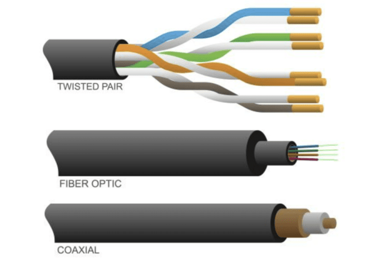
   
  <em>En la imagen se observan (de arriba hacia abajo): el cable UTP con sus pares trenzados, el cable de Fibra Óptica con sus hilos de vidrio y el cable Coaxial con su núcleo de cobre y malla protectora.</em>

  

#### Comparativa Técnica

| Característica | Cable Coaxial | Cable UTP (Par Trenzado) | Fibra Óptica |
| :--- | :--- | :--- | :--- |
| **Medio de transmisión** | Electricidad | Electricidad | **Luz (Pulsos de láser/LED)** |
| **Velocidad máxima** | Hasta 1 Gbps (aprox.) | Hasta 10 Gbps (Cat 6a/7) | **+100 Gbps** |
| **Distancia máxima** | ~500 metros | **100 metros** (Límite crítico) | Decenas de kilómetros |
| **Interferencia (EMI)** | Resistente (por la malla) | Sensible (sin blindaje) | **Inmune (Total)** |
| **Costo** | Medio | Bajo | Alto (Equipos y fusión) |
| **Uso común** | TV por cable e Internet HFC | Redes LAN (Oficinas/Hogar) | Backbones y enlaces submarinos |

#
### Resumen de componentes:

* **Cable Coaxial:** Tiene un núcleo de cobre grueso. La malla metálica que ves en la imagen lo protege de ruidos externos, por eso se usa mucho para traer internet desde la calle (donde hay muchos cables eléctricos).
* **UTP (Par Trenzado):** Es el cable de red común. Los cables se trenzan entre sí para que la interferencia de un hilo se cancele con la del otro. Es barato y flexible, pero después de los 100 metros la señal "se muere".
* **Fibra Óptica:** Es tecnología de punta. Como transmite luz sobre vidrio, no le afectan los motores eléctricos ni los rayos. Es la columna vertebral (**Backbone**) de internet.

<a href="#-índice-de-contenidos">⬆ Volver al Índice</a>

---

## 26. Según Cisco, ¿qué significa CCENT, CCNA y CCNP?

### Certificaciones Cisco: Niveles y Especialidades

Cisco Systems ofrece un sistema jerárquico de certificaciones que valida las competencias técnicas en el mundo de las telecomunicaciones. Estas certificaciones son reconocidas globalmente como el estándar de oro en IT.

#### Niveles de Certificación
* **CCENT (Entry):** Era el nivel de entrada básico. Aunque Cisco lo retiró en 2020 para simplificar su sistema, se lo sigue recordando como la base para técnicos que recién comenzaban a instalar redes pequeñas.
* **CCNA (Associate):** Es el nivel más popular y el punto de partida actual. Un profesional CCNA domina los fundamentos: conectividad IP, seguridad básica y, lo más importante hoy, principios de **automatización y programabilidad**.
* **CCNP (Professional):** Un nivel avanzado. Valida la capacidad de planificar e implementar redes complejas de gran escala (WAN) y resolver problemas profundos de arquitectura.

#

#### Especializaciones (Tracks)

Cisco divide el conocimiento en "carreras" o especialidades según el área de trabajo:

**1. Track Routing & Switching (Enterprise):**
Es el corazón de las redes. Se enfoca en cómo mover los datos de un punto A a un punto B de forma eficiente.
* **Temas clave:** Protocolos de enrutamiento (OSPF, BGP), protocolos de capa 2 (STP, VLANs) y diseño de redes jerárquicas. Es la base técnica para casi cualquier otra especialidad.

**2. Track Security (Seguridad):**
Se enfoca exclusivamente en blindar la red.
* **Temas clave:** Configuración de **Firewalls**, creación de túneles **VPN**, sistemas de detección de intrusos (IDS/IPS) y políticas de control de acceso para evitar hackeos o fugas de información.

| Nivel | Rol sugerido | Complejidad |
| :--- | :--- | :--- |
| **CCNA** | Administrador de red Jr. | Media - Fundamentos |
| **CCNP** | Ingeniero de redes Senior | Alta - Especialización |
| **CCIE** | Arquitecto de Infraestructura | Experto - Diseño de alto nivel |

<a href="#-índice-de-contenidos">⬆ Volver al Índice</a>

---

## 27. Explique el modelo OSI

### ¿Qué es el Modelo OSI?

El **Modelo OSI** (Open Systems Interconnection) es un marco conceptual creado por la ISO que estandariza cómo deben comunicarse los sistemas de red, sin importar el fabricante. Se divide en **7 capas**, donde cada una tiene una misión específica.

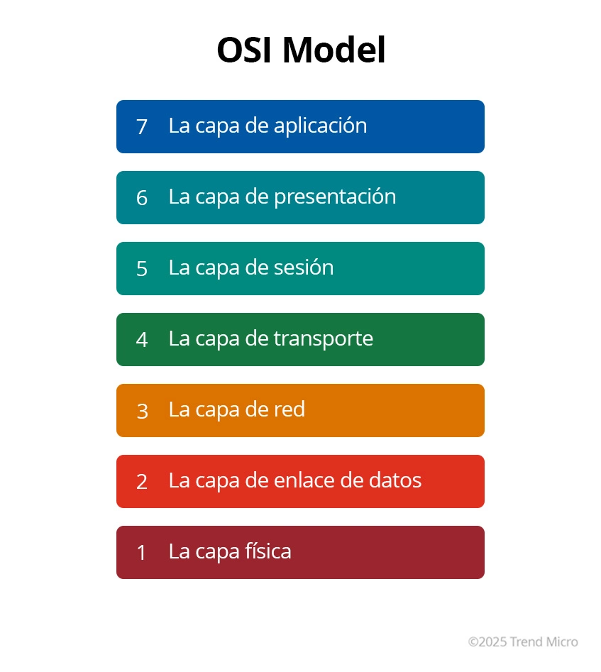

#### Las 7 Capas (Del cable al usuario)

1. **Capa Física (1):** Es el hardware puro. Cables, conectores y voltajes. Su unidad son los **Bits**.
2. **Capa de Enlace (2):** Se encarga de la conexión entre dos equipos vecinos. Usa la dirección **MAC**. Su unidad es la **Trama**. Aquí trabajan los *Switches*.
3. **Capa de Red (3):** Es la que elige el camino. Usa direcciones **IP** para el enrutamiento. Su unidad es el **Paquete**. Aquí trabajan los *Routers*.
4. **Capa de Transporte (4):** Se encarga de que los datos lleguen bien y completos (TCP) o rápido (UDP). Su unidad es el **Segmento**.
5. **Capa de Sesión (5):** Es el "anfitrión". Inicia, mantiene y corta la conversación entre dos computadoras.
6. **Capa de Presentación (6):** Es el "traductor". Se encarga de que el formato (JPEG, MP3) sea legible y de cifrar los datos por seguridad.
7. **Capa de Aplicación (7):** Es la que ves vos. La interfaz donde corren protocolos como **HTTP** (web) o **WhatsApp**.

 

#

#### Analogía del Correo Postal
Para entenderlo más fácil, imaginate que enviás una carta:
* **Aplicación:** Escribís el mensaje.
* **Presentación:** Lo escribís en español y lo ponés en un sobre.
* **Sesión:** Verificás que el destinatario esté disponible para recibirla.
* **Transporte:** Decidís si la mandás por correo certificado (TCP) o común (UDP).
* **Red:** El correo le pega una etiqueta con la dirección (IP).
* **Enlace:** La carta va en un camión desde el centro de distribución a tu casa (MAC).
* **Física:** Es el asfalto de la ruta por donde viaja el camión.

> **Dato extra:**
> Los programadores, trabaján casi siempre en la **Capa 7 (Aplicación)**. Sin embargo, cuando tu código tira un error de "Timeout" o "Connection Refused", el problema suele estar bajando hacia las **Capas 3 o 4**. Saber esto les ayuda a debugear mucho más rápido, es decir si el ping (Capa 3) falla, no tiene sentido que pierdas 2 horas revisando tu código de Python (Capa 7). El problema es de red, no de programación.

<a href="#-índice-de-contenidos">⬆ Volver al Índice</a>

---

## 28. Estándar IEEE 802.3

El **IEEE 802.3** es el estándar que regula las redes **Ethernet**. Define las reglas de la Capa 1 (Física) y la subcapa MAC de la Capa 2 (Enlace) del modelo OSI. Es la tecnología de red cableada más exitosa y utilizada en la historia.

#### ¿Cómo se implementa?
La forma en que usamos Ethernet ha cambiado drásticamente con los años:
* **Antes (Antiguo):** Se usaba cable coaxial en una "topología de bus" (un solo cable largo para todos). Si dos PCs hablaban al mismo tiempo, los datos chocaban (**colisión**).
* **Ahora (Moderno):** Se utiliza **cable UTP o Fibra Óptica** en una "topología de estrella". Todos los equipos se conectan a un **Switch** central. 
* **Full-Duplex:** Gracias a los switches modernos, los equipos pueden enviar y recibir datos al mismo tiempo sin que choquen, eliminando el problema de las colisiones.

#### Análisis de Ventajas y Desventajas

| Ventajas | Desventajas |
| :--- | :--- |
| **Bajo Costo:** Los cables y placas de red son muy económicos. | **Cero Movilidad:** Estás atado físicamente a un cable. |
| **Velocidad:** Evolucionó de 10 Mbps a más de 100 Gbps. | **Límite de Distancia:** El cobre (UTP) solo llega a **100 metros**. |
| **Compatibilidad:** Un equipo viejo de hace 15 años puede hablar con uno nuevo. | **Instalación:** Requiere canaletas, agujeros en paredes y mantenimiento físico. |
| **Simplicidad:** Es fácil de instalar y administrar. | **Costo de Obra:** En edificios viejos, pasar cables es caro y molesto. |

---

#### Resumen técnico:
El éxito del 802.3 se debe a su **interoperabilidad**. No importa quién fabrique el cable o la computadora; si ambos cumplen con el estándar IEEE 802.3, la comunicación está garantizada.

> **Dato extra:**
> Como desarrollador de software, Ethernet es tu mejor aliado para la estabilidad. Mientras que el Wi-Fi (802.11) puede tener interferencias o micro-cortes que arruinan un despliegue de código o una conexión a una base de datos, una conexión **802.3** te asegura una latencia constante y mínima, ideal para entornos de desarrollo y servidores.

<a href="#-índice-de-contenidos">⬆ Volver al Índice</a>

---

## 29. Estándar IEEE 802.4

### IEEE 802.4 (Token Bus)

El estándar **IEEE 802.4** define una configuración de red conocida como **Token Bus**. Aunque físicamente utiliza un cable central (bus), lógicamente funciona como un anillo donde los datos se transmiten de forma ordenada.

#### ¿Cómo funciona?
A diferencia de Ethernet (donde las PC "compiten" por hablar), en el estándar 802.4 se utiliza un **Token** (una trama de control o "ficha virtual"):
1. Solo la computadora que posee el **Token** tiene permiso para transmitir datos.
2. Una vez que termina de transmitir, le pasa el Token a la siguiente computadora en un orden predefinido (anillo lógico).
3. Si una computadora no tiene nada que enviar, pasa el Token inmediatamente a la siguiente.

#### Comparativa: Ventajas y Desventajas

| Ventajas | Desventajas |
| :--- | :--- |
| **Determinismo:** Se puede calcular con precisión el tiempo máximo de espera para transmitir (vital para fábricas). | **Latencia:** En redes con pocos datos, hay que esperar a que el token recorra todos los nodos. |
| **Sin Colisiones:** Al haber un solo "micrófono" virtual, los datos nunca chocan entre sí. | **Complejidad:** Si una PC falla o se apaga con el token, la red se detiene hasta regenerar uno nuevo. |
| **Estabilidad bajo carga:** La red no se vuelve lenta ni colapsa cuando hay mucho tráfico. | **Obsolescencia:** Es una tecnología cara y difícil de mantener comparada con los switches modernos. |

---

#### Escenario de aplicación
Históricamente, este estándar fue el preferido para la **automatización industrial** (plantas de montaje, robótica). En estos entornos, no importa tanto la velocidad punta, sino la garantía de que un sensor pueda enviar una señal de "parada de emergencia" en un tiempo exacto y garantizado.

> **Dato extra:** comprarativa entre estandares IEEE  802.x  (ver foto) 
  

  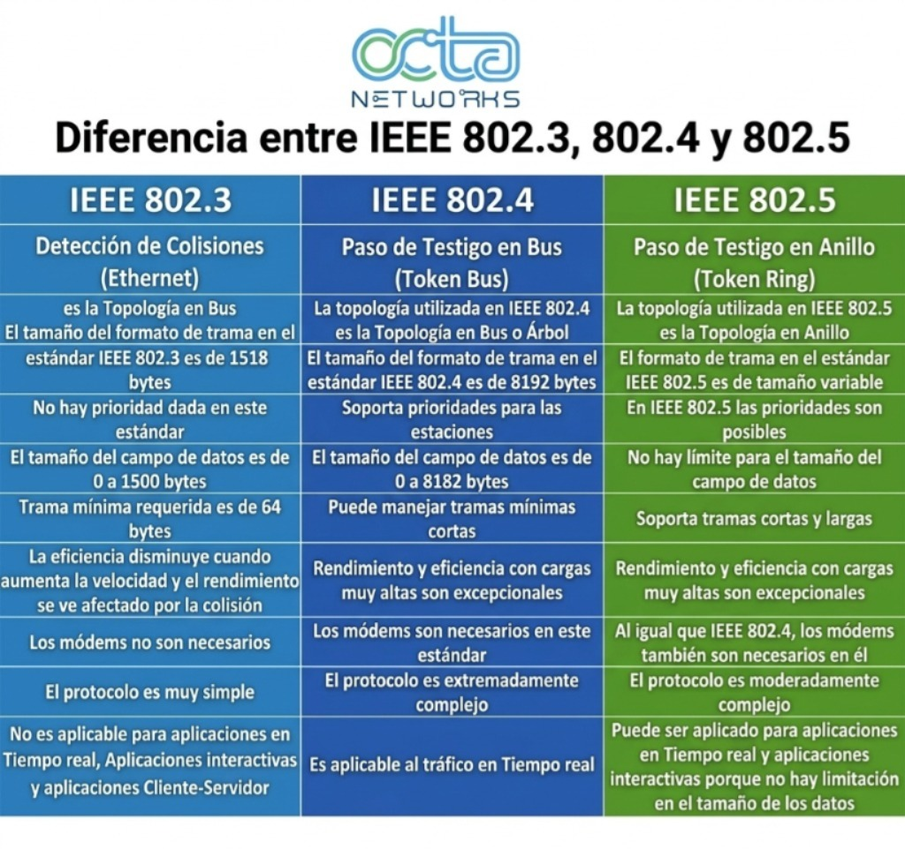
   

<a href="#-índice-de-contenidos">⬆ Volver al Índice</a>

---

## 30. Protocolos para enviar y recibir correo

Para que el correo electrónico funcione, el sistema divide las tareas en dos grandes grupos: protocolos de **envío** y protocolos de **recepción** (o consulta).

#### 1. SMTP (Simple Mail Transfer Protocol)
Es el protocolo dedicado exclusivamente al **envío** de mensajes. 
* **Función:** Transporta el correo desde tu dispositivo hacia el servidor, o entre diferentes servidores de correo.
* **Analogía:** Es el cartero que recoge tu sobre del buzón de salida y lo lleva a la central de distribución.

#### 2. POP3 (Post Office Protocol v3)
Es un protocolo para **recibir** o descargar correos.
* **Funcionamiento:** Descarga los mensajes a tu computadora y, por configuración estándar, los **borra del servidor**. 
* **Limitación:** No es ideal para el mundo actual donde usamos el mismo correo en el celular y la PC, ya que los mensajes no se sincronizan.

#### 3. IMAP (Internet Message Access Protocol)
Es el protocolo moderno para **consultar y sincronizar** correos.
* **Funcionamiento:** Permite visualizar los mensajes directamente en el servidor sin borrarlos. 
* **Ventaja:** Permite la sincronización total. Si leés un mail en el celular, aparece como leído en la PC. Es el estándar que usan servicios como Gmail o Outlook.

#

#### Resumen Comparativo

| Protocolo | Función | ¿Sincroniza? | Puerto Común (Seguro) |
| :--- | :--- | :--- | :--- |
| **SMTP** | Enviar | N/A | 587 / 465 |
| **POP3** | Recibir / Descargar | No | 995 |
| **IMAP** | Recibir / Consultar | **Sí** | 993 |

> **Dato extra:**
> Si tenés que programar una aplicación que envíe alertas automáticas, utilizarás una **librería SMTP**. Sin embargo, si tu sistema debe "escuchar" correos entrantes para procesar pedidos de clientes, deberás configurar una conexión **IMAP**.

<a href="#-índice-de-contenidos">⬆ Volver al Índice</a>

---

## 31. Protocolo para leer correo recibido

Para leer el correo recibido, se utilizan principalmente dos protocolos que determinan cómo interactúa el dispositivo del usuario con el servidor.

#### IMAP (Internet Message Access Protocol)
Es el protocolo preferido en la actualidad debido a su capacidad de **sincronización**.
* **Características:** Los correos se mantienen en el servidor. El usuario puede organizar carpetas, marcar mensajes como leídos o borrarlos, y estos cambios se verán reflejados en todos sus dispositivos (celular, tablet, PC).
* **Puerto seguro:** 993.

#### POP3 (Post Office Protocol v3)
Es un protocolo basado en la **descarga local**.
* **Características:** Por diseño, POP3 descarga los mensajes al dispositivo y los elimina del servidor. Esto significa que los correos solo son accesibles desde el equipo donde se descargaron.
* **Puerto seguro:** 995.

#

> **Dato extra:**
> Supongamos que en una empresa utilizan una cuenta de correo genérica (ej: ventas@empresa.com) que abren tres personas distintas. Si configuraran esa cuenta con **POP3**, la primera persona que abra el correo se "llevaría" los mensajes y los otros dos no verían nada. Por eso, en entornos colaborativos y multidispositivo, **IMAP** es la única opción lógica.

<a href="#-índice-de-contenidos">⬆ Volver al Índice</a>

---

## 32. Diferencias entre IPv4 e IPv6

Debido al crecimiento exponencial de dispositivos conectados, el estándar IPv4 llegó a su límite de capacidad. El protocolo IPv6 surge como la solución definitiva, ofreciendo un espacio de direccionamiento prácticamente infinito y mejoras en la eficiencia de red.

#### Cuadro Comparativo

| Característica | IPv4 | IPv6 |
| :--- | :--- | :--- |
| **Longitud** | 32 bits | 128 bits |
| **Formato** | Decimal (ej: 190.1.1.1) | Hexadecimal (ej: 2001:db8::1) |
| **N° de direcciones** | ~4.300 millones | ~340 sextillones |
| **Seguridad** | Opcional (IPsec) | Obligatoria/Nativa (IPsec) |
| **Configuración** | Manual o DHCP | Autoconfiguración (Plug & Play) |

**Ventajas de IPv6 sobre IPv4:**
1. **Escalabilidad:** Permite conectar billones de dispositivos nuevos (IoT).
2. **Sin necesidad de NAT:** Cada equipo puede tener una IP única global, mejorando la conectividad de extremo a extremo.
3. **Paquetes más eficientes:** Los routers procesan la información más rápido gracias a un encabezado fijo y simplificado.

<a href="#-índice-de-contenidos">⬆ Volver al Índice</a>

---

## 33. Experiencia en redes por integrante

### En esta sección detallamos el punto de partida técnico de cada miembro del equipo antes de cursar la asignatura:

| Integrante | Experiencia y Conocimientos Previos |
| :--- | :--- |
| **Diego Murgana** | Cuento con una experiencia práctica previa basica. Es decir, realicé un curso de redes hogareñas donde aprendí a configurar routers, instalar impresoras de red y gestionar carpetas compartidas. El resto de los conocimientos técnicos y teóricos los estoy profundizando durante la tecnicatura. |
| **Leandro Sosa** | No contaba con conocimientos previos de redes antes de ingresar a la tecnicatura. Todo lo que sé sobre la materia lo he aprendido y desarrollado a lo largo de esta cursada. |
| **Agustín Senin** | Me moví bastante en distintos niveles. Por el lado profesional, lo más común fue el uso de VPNs corporativas para acceder a recursos que no están expuestos, como bases de datos. Ahí te chocás siempre con el tema de la seguridad y los permisos de acceso. También tengo experiencia configurando servicios de comunicación como SMTP, lidiando con puertos y cifrado (TLS/SSL) para que los correos salgan como corresponde.

Tambien para la carga/baja de archivos uso todos los dias FTP con dreamweaver o filezilla dependiendo de la exclusividad del proyecto.

Fuera de la oficina, también me metí bastante en el mundo de las LAN virtuales. Usé herramientas tipo Hamachi para emular redes locales en videojuegos, lo que te obliga a entender cómo funciona el direccionamiento IP para que los dispositivos se vean entre sí. |
| **Santiago Padilla** | Mi experiencia personal sobre redes, la obtuve desarrollando, donde aprendi a desplegar puertos para bases de datos o aplicaciones Frontend y Backend. También configure SMTP para el envío de correos, repetidores de wifi y configurar VPN para jugar videojuegos con amigos. |

<a href="#-índice-de-contenidos">⬆ Volver al Índice</a>

---

**Trabajo Práctico — Programación sobre Redes | IFTS 18 | Grupo D**
